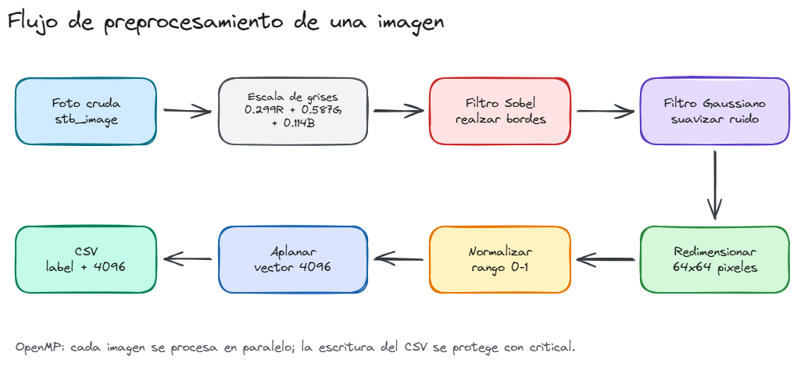

# CRISP-DM Phase 3: Data Preparation

## Objective

The objective of this phase is to transform the raw image collection into a clean, standardized, and structured dataset suitable for machine learning model training and evaluation. Data preparation is a critical step because it reduces variability, improves data quality, and ensures consistency across all samples.

---

## Data Preparation Pipeline

The preparation process followed a sequence of preprocessing steps designed to improve image quality and facilitate efficient model training.

The complete preprocessing flow is shown in the exported Excalidraw evidence image:



### 1. Data Review and Cleaning

The original dataset was inspected to verify the correctness of class labels and image quality.

The dataset contains two balanced classes:

- Class 0: Eyes open or partially open.
- Class 1: Eyes closed.

Images with labeling inconsistencies, duplicates, or severe quality issues were identified and removed when necessary.

**Justification:**

- Improves dataset reliability.
- Reduces the risk of introducing noise during training.
- Ensures correct class representation.

---

### 2. Image Resizing

Images were originally captured under different conditions and resolutions. To create a uniform dataset, images were resized to a standardized dimension before further processing.

**Justification:**

- Ensures all samples have identical dimensions.
- Reduces computational cost.
- Improves compatibility with machine learning algorithms.
- Facilitates parallel processing in OpenMP and CUDA implementations.

---

### 3. Grayscale Conversion

Most images were converted from RGB color space to grayscale.

Since the objective of the project is to identify eye state rather than color information, grayscale images preserve the most relevant visual features while reducing the amount of data to process.

**Justification:**

- Eliminates unnecessary color information.
- Reduces memory usage.
- Simplifies feature extraction.
- Improves processing efficiency.

---

### 4. Noise Reduction and Image Filtering

Basic preprocessing filters were applied to reduce visual noise caused by variations in illumination and image acquisition conditions.

The filtering process improves image clarity and highlights relevant eye-region characteristics.

**Justification:**

- Improves image quality.
- Reduces the impact of lighting variations.
- Facilitates pattern recognition.
- Produces more consistent samples.

---

### 5. Pixel Normalization

Pixel values were normalized before training.

Normalization transforms image values into a smaller numerical range, allowing machine learning algorithms to learn more efficiently and converge faster.

**Justification:**

- Stabilizes the training process.
- Prevents large numerical variations.
- Improves computational performance.
- Enhances model convergence.

---

### 6. Dataset Serialization

After preprocessing, the images were serialized into a structured CSV representation stored as:

- `dataset_serial.csv`

The serialized dataset contains processed image information together with the corresponding class labels.

**Justification:**

- Simplifies data loading.
- Facilitates experimentation.
- Enables efficient execution in serial, OpenMP, and CUDA versions.
- Provides a portable and structured dataset format.

---

### 7. Stratified Dataset Splitting

The processed dataset was divided into three subsets:

- `train.csv`
- `val.csv`
- `test.csv`

A stratified splitting strategy was used to preserve the balance between classes across all subsets.

**Justification:**

- Training data is used to learn model parameters.
- Validation data is used to tune hyperparameters and monitor performance.
- Testing data provides an unbiased evaluation of the final model.
- Maintains class balance during experimentation.

---

## Prepared Dataset Structure

```text
dataset/
├── raw/
├── procesado/
│   ├── dataset_serial.csv
│   ├── train.csv
│   ├── val.csv
│   ├── test.csv
│   └── split_report.md
├── CRISP-DM Phase 2.md
├── CRISP-DM Phase 3.md
└── README.md
```

---

## Data Preparation Results

After the preprocessing pipeline was completed:

- Images were standardized in format and dimensions.
- Most samples were converted to grayscale.
- Noise and illumination variability were reduced.
- Pixel values were normalized.
- The dataset was serialized into CSV format.
- Training, validation, and testing subsets were generated.
- Class balance was preserved across the dataset.

The final dataset contains:

| Class | Description | Images |
|---------|-------------|---------|
| 0 | Eyes Open | 1000 |
| 1 | Eyes Closed | 1000 |
| Total | Dataset Size | 2000 |

---

## Conclusions

The data preparation phase transformed the original image collection into a structured dataset suitable for machine learning and parallel computing experiments. Through resizing, grayscale conversion, filtering, normalization, serialization, and stratified splitting, the dataset became more consistent, efficient to process, and ready for the subsequent modeling and evaluation phases.

The resulting dataset provides a reliable foundation for comparing serial, OpenMP, and CUDA implementations in the drowsiness detection system.
