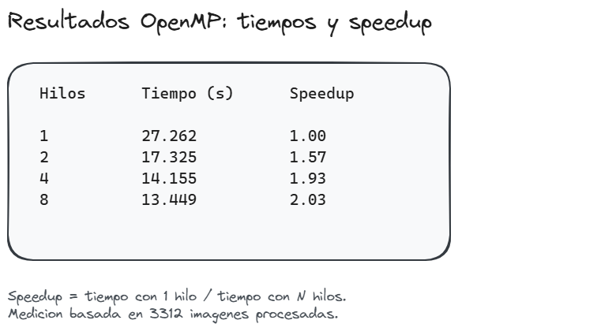
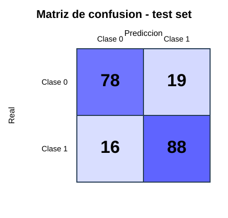

# Final Report — Drowsiness Image Classifier

**Programación Paralela y Computación Distribuida**  
**Universidad de Pamplona**

Custom image classifier built from scratch: **OpenMP** preprocessing, **CUDA** training, and **Streamlit** deployment for binary eye-state (alert vs. drowsy) classification.

This document consolidates all report sections into a single file. Source sections remain unchanged in their original files under `reporte/`.

---

---

<!-- Source: CRISP-DM Phase 1.md -->

# CRISP-DM Phase 1: Business Understanding

## 1. Problem Description

Drowsiness is one of the leading causes of accidents in activities that require constant attention, such as vehicle driving and machinery operation. Early detection of fatigue-related signs can help reduce risks and improve safety.

This project proposes the development of a system capable of identifying drowsiness states from facial images using digital image processing and machine learning techniques. The system will automatically classify whether a person shows signs of drowsiness or remains alert.

## 2. Project Objective

Develop a program capable of determining whether a person is drowsy or alert based on facial images. This will help identify whether an individual is maintaining attention or showing signs of fatigue, contributing to accident prevention and attention-state monitoring.

## 3. Use Cases

### Use Case 1: Road Safety

Detect potential drowsiness in drivers and generate alerts when signs of fatigue are identified, helping to prevent traffic accidents.

### Use Case 2: Industrial Environments

Monitor machine operators and workers performing high-risk tasks to identify signs of fatigue that may negatively affect their performance and safety.

### Use Case 3: Intelligent Monitoring Systems

Integrate the classifier into monitoring or surveillance applications that require real-time assessment of a person's attention level.

### Use Case 4: Academic Research

Use the system as a tool for studying the application of computer vision, image processing, and machine learning techniques in classification problems.

## Use Case Diagram

The following diagram summarizes the interactions between users and the drowsiness detection system.


---

<!-- Source: CRISP-DM Phase 2.md -->

#  CRISP-DM Phase 2: Data Understanding
## Dataset Description

For the development of this project, a custom dataset was created using images captured by the project team members. The purpose of this dataset is to provide the necessary data to train a model capable of identifying drowsiness states through eye analysis.

The dataset is organized into two classes. Class 0 contains images of people with their eyes open or partially open, while Class 1 contains images of people with their eyes closed. This classification makes it possible to distinguish between alert states and potential drowsiness states.

The images were collected under different lighting conditions and with different individuals in order to introduce diversity into the dataset and obtain more representative examples of real-world situations.

## Data Distribution

The dataset consists of a total of 2,000 images distributed equally between the two classes defined for the problem.

| Class | Description | Quantity |
|---------|------------|----------|
| Class 0 | Eyes open or partially open | 1000 |
| Class 1 | Eyes closed | 1000 |
| Total | Complete dataset | 2000 |

The balanced distribution of the classes is an important characteristic because it allows the model to learn both categories equally and reduces the possibility of favoring one class over the other during the learning process.

## Data Variability

During the image collection process, different conditions were considered to introduce variability into the dataset. These include changes in lighting conditions and differences among the individuals photographed.

This diversity is beneficial for model development because it allows the model to learn more general patterns and improves its ability to make predictions on images that were not used during training.

## Data Quality

A general review of the images was conducted to verify that each image was correctly assigned to its corresponding class. In addition, it was confirmed that the eye state could be clearly identified in each image, since this is the main feature used for classification.

Overall, the dataset presents an adequate level of quality for the development of the project, as the images clearly distinguish between open-eye and closed-eye states.

## Initial Findings

From the analysis performed, it was observed that the dataset has a balanced distribution between the two classes and a sufficient number of examples to begin model training. Furthermore, the visual difference between open and closed eyes represents a clearly distinguishable feature, making the application of machine learning techniques for drowsiness detection feasible.

The results obtained during this phase provide a solid foundation for the subsequent stages of the project, including data preparation and model training.

---

<!-- Source: dataset_section.md -->

# Dataset — Clasificador de Somnolencia

## Descripción general

El dataset fue creado por los integrantes del equipo mediante captura
con webcam y cámara frontal de teléfono. Cada imagen corresponde al
rostro de una persona con los ojos **abiertos** (clase 0) o **cerrados**
(clase 1), tomada en distintas condiciones de iluminación, distancia y
ángulo para introducir variabilidad realista.

## Cantidad de imágenes raw

| Clase | Descripción | Archivos |
|-------|-------------|---------:|
| 0 | Ojos abiertos | 1.656 |
| 1 | Ojos cerrados | 1.656 |
| **Total** | | **3.312** |

Formato: JPEG, nomenclatura `img_{XXXX}.jpeg` (misma numeración en
ambas clases, diferenciadas por la carpeta).

Distribución por clase perfectamente balanceada (50 % / 50 %).

## Cantidad de imágenes procesadas

El pipeline OpenMP (`etapa1_openmp/preprocess_serial.c`) convierte las
3.312 raw a vectores de 4096 features (64×64 en escala de grises,
normalizados) y los exporta como CSV.

Del CSV resultante se eliminan filas duplicadas exactas y se aplica un
split estratificado 70/15/15:

| Archivo | Muestras | Clase 0 | Clase 1 |
|---------|---------:|--------:|--------:|
| `dataset_serial.csv` | 3.312 | 1.656 | 1.656 |
| `train.csv` | 1.646 | 829 | 817 |
| `val.csv` | 353 | 178 | 175 |
| `test.csv` | 353 | 177 | 176 |
| **Total** | **2.352** | **1.184** | **1.168** |

La diferencia de 960 filas entre `dataset_serial.csv` (3.312) y la suma
de los splits (2.352) corresponde a filas duplicadas exactas que fueron
eliminadas automáticamente por el script de split.

> **Nota:** Los pesos finales del modelo (`modelo/weights.npz`) fueron
> entrenados con este dataset (2.352 muestras únicas, split
> 1.646/353/353), como se documenta en
> `dataset/procesado/split_report.md` y se verifica en el notebook
> `etapa2_cuda/gpu_model/model-gpu.ipynb` (Celda 27: test=353).

## Condiciones de captura

Las imágenes se recolectaron bajo las siguientes condiciones:

- **Dispositivos:** webcam integrada de laptop, cámara frontal de
  teléfono móvil, cámara trasera de teléfono móvil.
- **Iluminación:** luz natural (ventana), luz fluorescente de techo,
  lámpara de escritorio, condiciones mixtas.
- **Distancia:** ~20–50 cm del dispositivo (primer plano del rostro).
- **Ángulo:** preferentemente frontal, con ligeras variaciones de
  inclinación y rotación.
- **Fondo:** variable (habitaciones, oficina, espacios abiertos).
- **Accesorios:** con y sin gafas, diferentes peinados, maquillaje
  ocasional.

## Resoluciones observadas

Las imágenes raw presentan una amplia variedad de resoluciones debido
al uso de múltiples dispositivos. En una muestra de 100 imágenes se
encontraron 38 resoluciones distintas; las más frecuentes fueron:

| Resolución | Frecuencia |
|-----------:|-----------:|
| 360×480 | 28 % |
| 4032×3024 | 11 % |
| 3024×4032 | 8 % |
| 83×83 | 4 % |
| 82×82 | 4 % |
| 768×1024 | 4 % |
| Otras (32 resoluciones) | 41 % |

El pipeline de preprocesamiento estandariza todas las imágenes a
64×64 píxeles independientemente de la resolución original.

## Tabla resumen

| Métrica | Valor |
|---------|------:|
| Total imágenes raw | 3.312 |
| Clases | 2 (balanceadas) |
| Imágenes raw por clase | 1.656 |
| Imágenes procesadas (CSV) | 3.312 |
| Imágenes entrenamiento | 1.646 |
| Imágenes validación | 353 |
| Imágenes prueba | 353 |
| Features por muestra | 4.096 |
| Formato de salida | CSV (label + 4096 columnas) |
| Resolución de preprocesamiento | 64×64 píxeles |
| Archivos raw faltantes | 0 |

## Rejilla de muestras

A continuación se referencian ejemplos representativos de cada clase
extraídos directamente del repositorio.

### Clase 0 — Ojos abiertos (alertas)

| Muestra | Archivo |
|---------|---------|
| Muestra 1 | `dataset/raw/clase_0/img_0001.jpeg` |
| Muestra 2 | `dataset/raw/clase_0/img_0250.jpeg` |
| Muestra 3 | `dataset/raw/clase_0/img_0500.jpeg` |
| Muestra 4 | `dataset/raw/clase_0/img_0750.jpeg` |
| Muestra 5 | `dataset/raw/clase_0/img_1000.jpeg` |

### Clase 1 — Ojos cerrados (somnolencia)

| Muestra | Archivo |
|---------|---------|
| Muestra 1 | `dataset/raw/clase_1/img_0001.jpeg` |
| Muestra 2 | `dataset/raw/clase_1/img_0250.jpeg` |
| Muestra 3 | `dataset/raw/clase_1/img_0500.jpeg` |
| Muestra 4 | `dataset/raw/clase_1/img_0750.jpeg` |
| Muestra 5 | `dataset/raw/clase_1/img_1000.jpeg` |

La nomenclatura `img_{XXXX}.jpeg` es secuencial independiente en cada
carpeta; el mismo número en ambas carpetas **no** implica que sean la
misma persona o la misma sesión de captura.

---

<!-- Source: CRISP-DM Phase 3.md -->

# CRISP-DM Phase 3: Data Preparation

## Objective

The objective of this phase is to transform the raw image collection into a clean, standardized, and structured dataset suitable for machine learning model training and evaluation. Data preparation is a critical step because it reduces variability, improves data quality, and ensures consistency across all samples.

---

## Data Preparation Pipeline

The preparation process followed a sequence of preprocessing steps designed to improve image quality and facilitate efficient model training.

The complete preprocessing flow is shown in the exported Excalidraw evidence image:


### 1. Data Review and Cleaning

The original dataset was inspected to verify the correctness of class labels and image quality.

The dataset contains two balanced classes:

- Class 0: Eyes open or partially open.
- Class 1: Eyes closed.

Images with labeling inconsistencies, duplicates, or severe quality issues were identified and removed when necessary.

**Justification:**

- Improves dataset reliability.
- Reduces the risk of introducing noise during training.
- Ensures correct class representation.

---

### 2. Image Resizing

Images were originally captured under different conditions and resolutions. To create a uniform dataset, images were resized to a standardized dimension before further processing.

**Justification:**

- Ensures all samples have identical dimensions.
- Reduces computational cost.
- Improves compatibility with machine learning algorithms.
- Facilitates parallel processing in OpenMP and CUDA implementations.

---

### 3. Grayscale Conversion

Most images were converted from RGB color space to grayscale.

Since the objective of the project is to identify eye state rather than color information, grayscale images preserve the most relevant visual features while reducing the amount of data to process.

**Justification:**

- Eliminates unnecessary color information.
- Reduces memory usage.
- Simplifies feature extraction.
- Improves processing efficiency.

---

### 4. Noise Reduction and Image Filtering

Basic preprocessing filters were applied to reduce visual noise caused by variations in illumination and image acquisition conditions.

The filtering process improves image clarity and highlights relevant eye-region characteristics.

**Justification:**

- Improves image quality.
- Reduces the impact of lighting variations.
- Facilitates pattern recognition.
- Produces more consistent samples.

---

### 5. Pixel Normalization

Pixel values were normalized before training.

Normalization transforms image values into a smaller numerical range, allowing machine learning algorithms to learn more efficiently and converge faster.

**Justification:**

- Stabilizes the training process.
- Prevents large numerical variations.
- Improves computational performance.
- Enhances model convergence.

---

### 6. Dataset Serialization

After preprocessing, the images were serialized into a structured CSV representation stored as:

- `dataset_serial.csv`

The serialized dataset contains processed image information together with the corresponding class labels.

**Justification:**

- Simplifies data loading.
- Facilitates experimentation.
- Enables efficient execution in serial, OpenMP, and CUDA versions.
- Provides a portable and structured dataset format.

---

### 7. Stratified Dataset Splitting

The processed dataset was divided into three subsets:

- `train.csv`
- `val.csv`
- `test.csv`

A stratified splitting strategy was used to preserve the balance between classes across all subsets.

**Justification:**

- Training data is used to learn model parameters.
- Validation data is used to tune hyperparameters and monitor performance.
- Testing data provides an unbiased evaluation of the final model.
- Maintains class balance during experimentation.

---

## Prepared Dataset Structure

```text
dataset/
├── raw/
├── procesado/
│   ├── dataset_serial.csv
│   ├── train.csv
│   ├── val.csv
│   ├── test.csv
│   └── split_report.md
├── CRISP-DM Phase 2.md
├── CRISP-DM Phase 3.md
└── README.md
```

---

## Data Preparation Results

After the preprocessing pipeline was completed:

- Images were standardized in format and dimensions.
- Most samples were converted to grayscale.
- Noise and illumination variability were reduced.
- Pixel values were normalized.
- The dataset was serialized into CSV format.
- Training, validation, and testing subsets were generated.
- Class balance was preserved across the dataset.

The final dataset contains:

| Class | Description | Images |
|---------|-------------|---------|
| 0 | Eyes Open | 1000 |
| 1 | Eyes Closed | 1000 |
| Total | Dataset Size | 2000 |

---

## OpenMP Preprocessing Results

Stage 1 preprocessing was implemented in C with OpenMP (`etapa1_openmp/preprocess_serial.c`). The image loop uses `#pragma omp parallel for schedule(dynamic)`; the serial baseline is `OMP_NUM_THREADS=1`. Benchmarks were run on **3,312 images** with `gcc -Wall -Wextra -O2 -fopenmp`, measuring end-to-end time with `omp_get_wtime()` (CSV creation, both class directories, and file close).

Speedup is defined as \(S(p) = T_1 / T_p\), where \(T_1\) is the time with one thread and \(T_p\) with \(p\) threads.

| Threads | Time (s) | Speedup | Efficiency |
|--------:|---------:|--------:|-----------:|
| 1 | 27.262 | 1.00 | 1.00 |
| 2 | 17.325 | 1.57 | 0.79 |
| 4 | 14.155 | 1.93 | 0.48 |
| 8 | 13.449 | 2.03 | 0.25 |



Parallelism reduced total runtime at every thread count tested. The best measured speedup is **2.03×** at 8 threads (~51% less time than serial). Gains are sublinear: efficiency falls to **0.25** at 8 threads because part of the pipeline remains serial or synchronized.

### Amdahl's Law

Amdahl's law models speedup as \(S(p) = 1 / (s + (1-s)/p)\), where \(s\) is the serial fraction. Fitting \(T(p) = sT_1 + (1-s)T_1/p\) to the measurements yields:

| Quantity | Value |
|----------|------:|
| Serial fraction \(s\) | 0.38 |
| Maximum theoretical speedup \(1/s\) | 2.61× |
| Best measured speedup | 2.03× (78% of ceiling) |

The main scalability limiter is serialized CSV output inside `#pragma omp critical(csv_write)`: threads process images in parallel but append rows one at a time. Directory traversal and per-class setup also run outside the parallel region.

Full methodology, the Amdahl decomposition plot, and regeneration instructions are documented in [`openmp_results.md`](openmp_results.md).

---

## Conclusions

The data preparation phase transformed the original image collection into a structured dataset suitable for machine learning and parallel computing experiments. Through resizing, grayscale conversion, filtering, normalization, serialization, and stratified splitting, the dataset became more consistent, efficient to process, and ready for the subsequent modeling and evaluation phases.

The resulting dataset provides a reliable foundation for comparing serial, OpenMP, and CUDA implementations in the drowsiness detection system.

---

<!-- Source: openmp_results.md -->

# OpenMP Preprocessing Results

This section documents the performance evaluation of the Stage 1 preprocessing pipeline (`etapa1_openmp/preprocess_serial.c`) on **3,312 images** (classes `clase_0` and `clase_1`). Measurements were taken on the same machine and dataset for each thread count, varying only `OMP_NUM_THREADS`.

---

## Experimental Setup

| Parameter | Value |
|-----------|-------|
| Source program | `etapa1_openmp/preprocess_serial.c` |
| Compiler flags | `gcc -Wall -Wextra -O2 -fopenmp` |
| Parallel region | `#pragma omp parallel for schedule(dynamic)` over the image loop |
| Serial baseline | `OMP_NUM_THREADS=1` |
| Thread counts tested | 1, 2, 4, 8 |
| Dataset size | 3,312 raw images |
| Output | `dataset/procesado/dataset_serial.csv` (4,096 features + label per row) |

The timer uses `omp_get_wtime()` around the full run: CSV creation, both class directories, and file close.

---

## Speedup Table

Speedup is defined as:

\[
S(p) = \frac{T_1}{T_p}
\]

where \(T_1\) is the elapsed time with one thread and \(T_p\) is the time with \(p\) threads.

| Threads | Time (s) | Speedup \(S(p)\) | Efficiency \(S(p)/p\) |
|--------:|---------:|-----------------:|----------------------:|
| 1 | 27.262 | 1.00 | 1.00 |
| 2 | 17.325 | 1.57 | 0.79 |
| 4 | 14.155 | 1.93 | 0.48 |
| 8 | 13.449 | 2.03 | 0.25 |

### Interpretation

- Parallelism reduces total runtime for every configuration tested.
- The best result is **2.03×** at 8 threads.
- Gains are **sublinear**: doubling threads does not double performance.
- Efficiency drops as thread count grows, which indicates increasing overhead and contention.

---

## Speedup Graph


The left panel reproduces the measurement table; the right panel compares observed speedup against the Amdahl model fitted from the same data.

A complementary decomposition plot is available in `evidencias/openmp_amdahl_analysis.png`.

To regenerate the figures:

```bash
python scripts/plot_openmp_speedup.py
```

---

## Amdahl's Law Analysis

### Model

Amdahl's law states that if a program has a serial fraction \(s\) and a parallel fraction \(1-s\), the speedup with \(p\) processors is:

\[
S(p) = \frac{1}{s + \dfrac{1-s}{p}}
\]

Equivalently, the expected runtime is:

\[
T(p) = s\,T_1 + \frac{(1-s)\,T_1}{p}
\]

The maximum achievable speedup as \(p \to \infty\) is:

\[
S_{\max} = \frac{1}{s}
\]

### Serial Bottlenecks in This Pipeline

Even though the main image loop is parallelized, several stages remain effectively serial or introduce synchronization:

1. **Directory traversal** — `collect_image_paths()` runs before the parallel loop for each class.
2. **CSV header and file setup** — executed once in `main()` before processing.
3. **Critical CSV writes** — each processed image enters `#pragma omp critical(csv_write)`, so rows are appended one at a time to a single file.
4. **Error logging** — warnings use `#pragma omp critical(stderr_write)`.
5. **Two class passes** — `clase_0` and `clase_1` are processed sequentially.

The dominant limiter at higher thread counts is the **serialized CSV export**: threads finish image processing at different rates (`schedule(dynamic)`), but only one thread can write at a time. That behavior increases lock contention and explains why efficiency falls to **25%** with 8 threads.

### Fitted Parameters

Fitting the linear model \(T(p) = sT_1 + (1-s)T_1/p\) to the four measurements yields:

| Quantity | Value |
|----------|------:|
| Serial fraction \(s\) | 0.38 |
| Parallel fraction \(1-s\) | 0.62 |
| Estimated serial time | 10.42 s |
| Estimated parallelizable time (at 1 thread) | 16.84 s |
| Maximum theoretical speedup \(1/s\) | 2.61× |

### Observed vs. Theoretical Speedup

| Threads | Measured \(S(p)\) | Amdahl model \(S(p)\) | Gap |
|--------:|------------------:|----------------------:|----:|
| 1 | 1.00 | 1.00 | 0.00 |
| 2 | 1.57 | 1.45 | +0.13 |
| 4 | 1.93 | 1.86 | +0.07 |
| 8 | 2.03 | 2.18 | −0.15 |

The model tracks the general trend but does not match every point exactly. At 2 and 4 threads the measured speedup is slightly **above** the fitted curve; at 8 threads it falls **below** it. That pattern is consistent with extra contention at higher concurrency (CSV critical section, memory bandwidth, dynamic scheduling overhead) that a single-parameter Amdahl model does not capture.

The fitted ceiling is **2.61×**, and the best measured result (**2.03×** at 8 threads) reaches roughly **78%** of that limit.

### Practical Conclusion

OpenMP provides a clear benefit for CPU-side preprocessing: total time drops from **27.3 s** to **13.4 s** (~**51%** less). However, the serialized I/O path caps scalability. For this project the result is acceptable because preprocessing runs offline once to build the training CSV, and the exported format is shared by CPU training, GPU training, and Streamlit inference.

If higher speedup were required, the main improvement would be to **remove the CSV write critical section** — for example, by having each thread write to a private buffer or temporary file and merging once, or by exporting a binary format with parallel I/O.

---

## Summary

| Metric | Best value |
|--------|------------|
| Fastest configuration | 8 threads, 13.449 s |
| Best speedup | 2.03× vs. serial |
| Best efficiency | 0.79 (2 threads) |
| Amdahl serial fraction (fit) | 0.38 |
| Main scalability limiter | Serialized CSV writes |

Stage 1 successfully parallelized the per-image preprocessing workload with OpenMP. The measurements and Amdahl analysis show both the gain obtained and the structural reason why speedup remains sublinear.

---

<!-- Source: CRISP-DM Phase 4.md -->

# CRISP-DM Phase 4: Modeling

## Objective

The objective of this phase is to define, train, and document the machine learning model used to classify eye states from the preprocessed image features produced in Phase 3. The model must learn to distinguish between alert (class 0: eyes open) and drowsy (class 1: eyes closed) states from a fixed-length feature vector, while remaining simple enough to implement and accelerate with custom CUDA kernels.

This phase covers model selection, network architecture, parameter count, activation functions, loss function, optimizer, hyperparameter search, and the final training configuration used to produce `modelo/weights.npz`.

---

## Model Selection

A **feedforward multilayer perceptron (MLP)** was chosen for this project because:

- The Stage 1 preprocessing pipeline already extracts a structured numerical representation (4096 normalized pixel values per image).
- A shallow fully connected network is sufficient for binary classification on this feature space.
- The architecture can be implemented from scratch in C/CUDA without external deep-learning frameworks, which aligns with the academic goal of demonstrating parallel computing techniques.
- The same model definition is shared between the CPU baseline, the CUDA trainer, and the Streamlit inference application.

---

## Network Architecture

The final classifier is a two-layer MLP for **binary classification**:

```text
Input (4096) → Dense (75, ReLU) → Dense (1, Sigmoid) → ŷ ∈ (0, 1)
```

### Layer-by-Layer Description

| Layer | Type | Input Size | Output Size | Activation | Role |
|-------|------|------------|-------------|------------|------|
| 0 | Input | — | 4096 | — | Flattened preprocessed image |
| 1 | Fully connected | 4096 | 75 | ReLU | Hidden representation |
| 2 | Fully connected | 75 | 1 | Sigmoid | Probability of class 1 |

**Input features:** Each sample is a 4096-dimensional vector obtained after grayscale conversion, Sobel and Gaussian filtering, resizing to 64×64, normalization to [0, 1], and flattening (see Phase 3).

**Output:** A single scalar \(\hat{y}\) interpreted as the probability that the image belongs to class 1 (eyes closed / drowsiness).

**Decision rule:** Predict class 1 if \(\hat{y} \geq 0.5\); otherwise predict class 0.

### Forward Pass

The forward pass is identical in training (`etapa2_cuda/gpu_model/train_gpu.cu`) and inference (`app_streamlit/core/inference.py`):

\[
\mathbf{z}_1 = \mathbf{x}\mathbf{W}_1^\top + \mathbf{b}_1,\quad \mathbf{a}_1 = \mathrm{ReLU}(\mathbf{z}_1)
\]

\[
z_2 = \mathbf{a}_1 \mathbf{W}_2^\top + b_2,\quad \hat{y} = \sigma(z_2) = \frac{1}{1 + e^{-z_2}}
\]

Where:

- \(\mathbf{x}\) is the input feature vector of shape (4096,).
- \(\mathbf{W}_1 \in \mathbb{R}^{75 \times 4096}\), \(\mathbf{b}_1 \in \mathbb{R}^{75}\).
- \(\mathbf{W}_2 \in \mathbb{R}^{1 \times 75}\), \(b_2 \in \mathbb{R}\).

### Activation Functions

| Layer | Activation | Definition | Purpose |
|-------|------------|------------|---------|
| Hidden | ReLU | \(\max(0, z)\) | Introduces non-linearity while keeping gradients simple for backpropagation |
| Output | Sigmoid | \(1 / (1 + e^{-z})\) | Maps the logit to a probability in (0, 1) for binary classification |

---

## Parameter Count

With `hidden_units = 75`, the model has **307,351 trainable parameters**:

| Parameter | Shape | Count |
|-----------|-------|------:|
| \(\mathbf{W}_1\) | (75, 4096) | 307,200 |
| \(\mathbf{b}_1\) | (75,) | 75 |
| \(\mathbf{W}_2\) | (1, 75) | 75 |
| \(b_2\) | (1,) | 1 |
| **Total** | | **307,351** |

### Weight Initialization

| Parameter | Initialization |
|-----------|----------------|
| \(\mathbf{W}_1\) | Glorot/Xavier uniform: limit \(= \sqrt{6 / (\text{fan\_in} + \text{fan\_out})}\) |
| \(\mathbf{W}_2\) | Glorot/Xavier uniform (output layer; no ReLU follows) |
| \(\mathbf{b}_1\), \(b_2\) | Zeros |

Weights are initialized with a fixed random seed to ensure reproducibility across CPU and GPU runs.

---

## Loss Function

The model is trained by minimizing **Binary Cross-Entropy (BCE)**, averaged over the training set:

\[
\mathcal{L} = -\frac{1}{N}\sum_{i=1}^{N}\left[y_i \log(\hat{y}_i) + (1 - y_i)\log(1 - \hat{y}_i)\right]
\]

Predictions are clipped to \([10^{-7}, 1 - 10^{-7}]\) during loss computation to avoid numerical instability when \(\hat{y}_i\) is exactly 0 or 1.

The output-layer gradient simplifies to \(\partial \mathcal{L} / \partial z_2 = \hat{y} - y\), which is used directly in the manual backpropagation kernels.

---

## Training Procedure

### Optimizer

**Stochastic Gradient Descent (SGD)**, implemented manually without external frameworks:

\[
\theta \leftarrow \theta - \eta \cdot \frac{1}{N}\nabla_\theta \mathcal{L}
\]

Where \(\eta\) is the learning rate and \(N\) is the number of training samples.

### Training Mode

- **Full-batch:** All training samples are used in each epoch (no mini-batch shuffling).
- **Momentum:** Disabled (default 0.0).
- **L2 regularization:** Disabled (default 0.0).
- **Learning-rate decay:** Disabled (default factor 1.0 per epoch).

### Training and Validation Data

| Split | File | Samples |
|-------|------|--------:|
| Train | `dataset/procesado/train.csv` | 1,646 |
| Validation | `dataset/procesado/val.csv` | 353 |

The validation set was used exclusively for hyperparameter selection. The test set was held out until Phase 5.

---

## Hyperparameter Search

A grid search was performed on the GPU implementation (`etapa2_cuda/gpu_model/model-gpu.ipynb`) to select the best combination of architecture size, learning rate, and number of epochs. The search space was:

| Hyperparameter | Values explored |
|----------------|-----------------|
| Hidden units | 64, 75, 78, 128 |
| Learning rate | 0.01, 0.08, 0.1 |
| Epochs | 20, 40, 45, 50 |

All runs used `block_size = 32` for the tiled matrix-multiplication CUDA kernels. This parameter affects GPU kernel performance only; it does not change the model architecture.

### Best Configuration (Selected on Validation Set)

| Hyperparameter | Value |
|----------------|-------|
| Hidden units | **75** |
| Learning rate | **0.1** |
| Epochs | **50** |
| Validation loss | 0.5402 |
| Validation accuracy | 0.8272 |

This configuration was used for the final GPU training run documented in `etapa2_cuda/gpu_model/gpu_report.md`.

---

## Implementation

### CUDA Training (`etapa2_cuda/gpu_model/train_gpu.cu`)

The GPU trainer implements the full forward and backward passes with custom CUDA kernels:

| Kernel | Purpose |
|--------|---------|
| `matmul_ab_tiled` | Forward matrix multiplication with shared memory |
| `matmul_atb` | Transposed multiplication for weight gradients |
| `bias_relu_forward` | Bias addition + ReLU (hidden layer) |
| `bias_sigmoid_forward` | Bias addition + sigmoid (output layer) |
| `bce_loss_kernel` | Binary cross-entropy loss |
| `output_gradient_kernel` | Output-layer error signal |
| `hidden_gradient_kernel` | Hidden-layer backpropagation through ReLU |
| `bias_gradient_kernel` | Bias gradient accumulation |
| `sgd_update_kernel` | Weight update step |

Training was executed on a **Tesla T4** GPU. The final training loop completed in approximately **0.30 s** for 50 epochs (full-batch), compared to **3.17 s** for the CPU baseline on the same architecture class.

### Weight Export

Trained weights are saved in binary format by `train_gpu.cu` (`weights_gpu.bin`) and converted to NumPy format for inference:

```bash
python3 modelo/export_weights.py \
    --input etapa2_cuda/gpu_model/weights_gpu.bin \
    --output modelo/weights.npz
```

The exported `modelo/weights.npz` contains keys `W1`, `b1`, `W2`, `b2` with shapes documented in `modelo/README.md`. This file is consumed by the evaluation script (`scripts/evaluate_final_metrics.py`) and the Streamlit application (`app_streamlit/`).

---

## Summary

| Aspect | Final choice |
|--------|--------------|
| Model type | Feedforward MLP (2 dense layers) |
| Architecture | 4096 → 75 (ReLU) → 1 (Sigmoid) |
| Parameters | 307,351 |
| Loss | Binary cross-entropy |
| Optimizer | SGD (full-batch, lr = 0.1) |
| Epochs | 50 |
| Decision threshold | 0.5 |
| Output weights | `modelo/weights.npz` |

---

## Conclusions

The modeling phase produced a compact MLP capable of learning discriminative patterns from the 4096-dimensional preprocessed features. Hyperparameter search on the validation set identified 75 hidden units with a learning rate of 0.1 and 50 epochs as the best trade-off between validation loss and accuracy. The manual CUDA implementation enabled fast experimentation and achieved a speedup of approximately **10.4×** over the CPU baseline while preserving the same mathematical model.

The trained weights were exported to a reusable format for evaluation (Phase 5) and deployment in the Streamlit inference application. The next phase evaluates generalization on the held-out test set and reflects on the complete pipeline.

---

<!-- Source: CRISP-DM Phase 5.md -->

# CRISP-DM Fase 5: Evaluation

## Objetive

EThe objective of this phase is to evaluate the final drowsiness classification model and determine whether the obtained results are consistent with the project's goal: identifying eye states from processed images to support a basic drowsiness detection system.

The evaluation considers the final metrics obtained on the test set, the confusion matrix, the behavior observed during training, and the insights gained from the two main stages of the project:

- Stage 1: Image preprocessing using OpenMP.
- Stage 2: Model training and acceleration using CUDA.

---

## Evaluation Dataset

The final evaluation was performed using the independent test subset:

- File: `dataset/procesado/test.csv`
- Number of samples: `201`
- Input format: 4096 normalized features per image.
- Evaluated model: `modelo/weights.npz`
- Decision threshold: `0.5`

The test set was not used during model training. Therefore, it provides a more objective estimate of the classifier's performance on unseen data.

---

## Final Test Metrics

The final model was evaluated using the following classification metrics:

| Metric | Value |
|---------|---------:|
| Binary Cross-Entropy Loss | 0.5636 |
| Accuracy | 0.8259 |
| Precision | 0.8224 |
| Recall | 0.8462 |
| F1-score | 0.8341 |

### Metrics Interpretation

**Accuracy:** The model correctly classified approximately 82.59% of the samples in the test set. This result indicates that the model successfully learned useful visual patterns from the processed eye images.

**Precision:** When the model predicted the positive class, it was correct approximately 82.24% of the time. This metric is important because it measures how reliable the positive alerts generated by the system are.

**Recall:** The model detected approximately 84.62% of the actual positive-class samples. In a drowsiness detection system, this metric is especially relevant because failing to detect a drowsy state may represent a safety risk.

**F1-score:** This metric combines precision and recall into a single value. The score of 0.8341 indicates a balanced performance between correctly detecting the positive class and avoiding excessive false positives.

---

## Confusion Matrix

The confusion matrix obtained on the test set was:

| Actual \ Prediction | Class 0 | Class 1 |
|---------|---------:|---------:|
| Class 0 | 78 | 19 |
| Class 1 | 16 | 88 |

Where:

- **True Negatives (TN):** 78 Class 0 samples were correctly classified as Class 0.
- **False Positives (FP):** 19 Class 0 samples were incorrectly classified as Class 1.
- **False Negatives (FN):** 16 Class 1 samples were incorrectly classified as Class 0.
- **True Positives (TP):** 88 Class 1 samples were correctly classified as Class 1.

The generated visual evidence can be found in:



---

## Loss Curves

The loss curves generated during training are documented in the evidence folder:

- `reporte/evidencias/gpu_training_curves.png`
- `reporte/evidencias/cpu_baseline_training_curves.png`

These curves help verify whether the training process converges properly and whether the validation loss follows a reasonable trend. In this project, the curves show that the model improves throughout training and achieves useful validation performance, although there is still room for improvement through additional data, regularization techniques, or a more robust architecture.

---

## Stage 1 Reflection: OpenMP Preprocessing

The first stage focused on transforming the original images into a structured dataset suitable for training. The preprocessing pipeline included image loading, grayscale conversion, Sobel filtering, Gaussian filtering, resizing to 64×64 pixels, normalization, flattening, and CSV export.

### Positive Aspects

- The OpenMP implementation allowed multiple images to be processed in parallel using CPU threads.
- The pipeline produced a consistent input format for both CPU and GPU training.
- Normalization and reducing each image to 4096 features simplified the model input.
- The same preprocessing pipeline could later be reused in the inference application.

### Observed Results

See the full write-up in [`openmp_results.md`](openmp_results.md) (speedup table, graphs, and Amdahl analysis).

| Threads | Time (s) | Speedup | Efficiency |
|---------:|---------:|---------:|-----------:|
| 1 | 27.262 | 1.00 | 1.00 |
| 2 | 17.325 | 1.57 | 0.79 |
| 4 | 14.155 | 1.93 | 0.48 |
| 8 | 13.449 | 2.03 | 0.25 |


The results show that parallelism improved performance for 2, 4, and 8 threads. The highest speedup was **2.03×** with 8 threads. Gains are sublinear: an Amdahl fit on the measurements estimates a serial fraction of **0.38** and a maximum theoretical speedup of **2.61×**, limited mainly by serialized CSV writes inside `#pragma omp critical(csv_write)`.

### Lessons Learned

OpenMP is an effective tool for accelerating repetitive CPU tasks, especially when the workload per image is large enough to compensate for thread management overhead. In this project, the best improvements were observed with 4 and 8 threads.

---

## Stage 2 Reflection: CUDA Training

The second stage focused on training the neural network using CUDA. The final model architecture was:

```text
Input (4096) -> Dense (75, ReLU) -> Dense (1, Sigmoid)
```

Training used Binary Cross-Entropy as the loss function and a manually implemented SGD optimizer.

### Positive Aspects

- CUDA significantly reduced training time compared to the CPU baseline.
- The GPU implementation enabled experimentation with multiple hyperparameter combinations.
- The final model achieved satisfactory validation and test performance.
- Exporting weights to `weights.npz` allowed the model to be reused in both the evaluation script and the Streamlit application.

### Observed Results

| Hidden Neurons | Learning Rate | Epochs | Validation Loss | Validation Accuracy |
|---------:|---------:|---------:|---------:|---------:|
| 75 | 0.1 | 50 | 0.5402 | 0.8272 |

| Version | Training Time (s) |
|---------|---------:|
| CPU Baseline | 3.1745 |
| GPU CUDA | 0.3041 |
| Speedup | 10.44x |

### Lessons Learned

CUDA provides a clear advantage for highly parallel numerical operations such as matrix multiplication and gradient computation. However, implementing training manually also increases project complexity.

---

## Overall Evaluation

The final model fulfills the academic objective of the project: building an image classifier based on a custom preprocessing pipeline and training it using parallel computing techniques.

The results are encouraging because:

- Test accuracy exceeds 80%.
- Precision and recall remain well balanced.
- The F1-score confirms that performance does not rely on a single metric.
- The confusion matrix shows that both classes are effectively recognized.
- The project integrates the complete workflow: raw images, preprocessing, training, evaluation, and inference.

### Limitations

- The dataset was collected under controlled conditions and may not represent all real-world scenarios.
- The model depends heavily on consistent preprocessing.
- False positives and false negatives are still present.
- A real-world deployment would require more data and stricter validation.

---

## Improvement Opportunities

Future work may include:

- Expanding the dataset with more subjects and lighting conditions.
- Exploring convolutional neural networks.
- Applying data augmentation techniques.
- Improving automatic eye-region detection.
- Evaluating the system in real-time scenarios.
- Comparing additional OpenMP and CUDA configurations.
- Incorporating cross-validation techniques.

---

## Conclusion

The evaluation phase confirms that the project successfully developed a functional drowsiness classification pipeline. Stage 1 produced a standardized dataset through OpenMP-based preprocessing, while Stage 2 accelerated model training using CUDA and generated reusable weights for evaluation and inference.

The final metrics demonstrate that the classifier can distinguish between the two eye states with acceptable performance for an academic prototype. The confusion matrix confirms that both classes are recognized effectively, although additional work is required before considering deployment in a real-world critical environment.

---

<!-- Source: final_metrics.md -->

# Metricas finales del modelo

Esta seccion documenta como reproducir la evaluacion final solicitada para el
test set: exactitud, precision, recall, F1 y matriz de confusion.

## Comando

```bash
python scripts/evaluate_final_metrics.py
```

Entradas por defecto:

- `modelo/weights.npz`
- `dataset/procesado/test.csv`

Salidas por defecto:

- `reporte/evidencias/final_metrics.md`
- `reporte/evidencias/final_metrics/metrics.json`
- `reporte/evidencias/final_metrics/confusion_matrix.csv`
- `reporte/evidencias/final_metrics/confusion_matrix.svg`
- `reporte/evidencias/final_metrics/predictions.csv`

## Curvas de perdida

Las curvas de perdida ya generadas para el entrenamiento estan en:

- `reporte/evidencias/gpu_training_curves.png`
- `reporte/evidencias/cpu_baseline_training_curves.png`

El resumen con los resultados calculados queda en
`reporte/evidencias/final_metrics.md`.

## Mensajes de commit sugeridos

- `feat: add final metrics evaluation script`
- `docs: add confusion matrix and loss curves`

---

<!-- Source: evidencias/final_metrics.md -->

# Metricas finales sobre test set

Evaluacion del modelo final `modelo/weights.npz` sobre `dataset/procesado/test.csv`.

## Resumen

| Metrica | Valor |
|---|---:|
| Muestras | 201 |
| Loss BCE | 0.5636 |
| Exactitud | 0.8259 |
| Precision | 0.8224 |
| Recall | 0.8462 |
| F1 | 0.8341 |

## Matriz de confusion

| Real \ Prediccion | Clase 0 | Clase 1 |
|---|---:|---:|
| Clase 0 | 78 | 19 |
| Clase 1 | 16 | 88 |


## Curvas de perdida

Las curvas de perdida generadas durante el entrenamiento estan documentadas en:

- `reporte/evidencias/gpu_training_curves.png`
- `reporte/evidencias/cpu_baseline_training_curves.png`

## Archivos generados

- `reporte/evidencias/final_metrics/metrics.json`
- `reporte/evidencias/final_metrics/confusion_matrix.csv`
- `reporte/evidencias/final_metrics/confusion_matrix.svg`
- `reporte/evidencias/final_metrics/predictions.csv`

---

<!-- Source: CRISP-DM Phase 6.md -->

# CRISP-DM Phase 6: Deployment

## Objective

The objective of this phase is to deploy the trained drowsiness classifier as an interactive inference application that end users can run without retraining the model or manually executing the preprocessing pipeline. The deployment closes the CRISP-DM cycle by making the system usable on new images captured in real time, while preserving the same preprocessing contract and forward pass used during training and evaluation.

The deliverable is a **Streamlit web application** (`app_streamlit/`) that:

1. Accepts a new image from file upload or camera capture.
2. Detects and crops the eye region when possible.
3. Applies the same preprocessing pipeline as Stage 1 (OpenMP).
4. Loads the exported weights from `modelo/weights.npz`.
5. Displays the prediction, confidence, quality checks, and an educational view of the pipeline.

---

## Deployment Overview

The project follows a **model-in-image** deployment strategy: trained weights are bundled with the application at build time. Inference runs on the server using NumPy on CPU; CUDA is used only during offline training.

```text
User (browser)
    │
    ▼
Streamlit server (app_streamlit/app.py)
    │
    ├── Haar cascades (OpenCV) ──► eye-region crop
    ├── preprocessing.py ────────► 4096-dim feature vector
    ├── inference.py ────────────► probability + class
    └── ui/components.py ────────► result, metrics, explainers
```

Runtime dependencies:

- `modelo/weights.npz` — trained MLP weights (required).
- `reporte/evidencias/final_metrics/metrics.json` — optional; sidebar test accuracy.

The application does not depend on the raw dataset or the OpenMP binary at runtime.

---

## Application Architecture

Numeric logic is separated from presentation so preprocessing and inference can be tested without Streamlit.

| Module | Responsibility |
|--------|----------------|
| `app.py` | Entry point: page config, cached resource loading, orchestration |
| `core/preprocessing.py` | Grayscale → Sobel → Gaussian → 64×64 → normalize → flatten (matches `preprocess_serial.c`) |
| `core/inference.py` | Weight loading, ReLU + sigmoid forward pass, decision threshold |
| `core/detection.py` | Face and eye detection with OpenCV Haar cascades |
| `core/quality.py` | Extensible brightness and contrast checks |
| `ui/components.py` | Sidebar, input widgets, result cards, pipeline explainer |
| `ui/theme.py` | Neutral design tokens and custom CSS |

### Resource caching

Heavy resources load once per server process via `@st.cache_resource`:

- Model weights (`load_weights`).
- Haar cascade classifiers (`build_eye_detectors`).

Sidebar metadata (architecture, parameter count, accuracy) is derived from `weights.npz` and `metrics.json`, not hardcoded strings.

### Extension points

- **Quality checks** — add a `QualityCheck` to `core/quality.QUALITY_CHECKS`.
- **Input sources** — add an `ImageSource` to `ui/components.INPUT_SOURCES`.
- **Decision threshold** — single constant `core.inference.DECISION_THRESHOLD` (tune with `modelo/tune_threshold.py`).

---

## End-to-End Inference Pipeline

### 1. Image acquisition

| Source | Details |
|--------|---------|
| File upload | JPG, JPEG, PNG via `st.file_uploader` |
| Camera | `st.camera_input` with optional digital zoom (1.0×–3.0×) |

Images pass through EXIF orientation correction (`ImageOps.exif_transpose`).

### 2. Eye-region detection

Training data uses small eye crops (~78×78 px). At inference, `core/detection.py` aligns input with that distribution:

1. Detect largest frontal face (Haar cascade).
2. Search eyes in the upper 60% of the face ROI.
3. If no face, fall back to full-image eye detection.
4. Crop largest eye with 30% padding into a square.

| Status | Behavior |
|--------|----------|
| `ojo` | Eye crop sent to preprocessing (preferred) |
| `rostro_sin_ojos` | Full image used; lower expected accuracy |
| `sin_deteccion` | Full image used; user advised to improve framing |

### 3. Preprocessing

Mirrors `etapa1_openmp/preprocess_serial.c`:

1. RGB → grayscale (BT.601: 0.299, 0.587, 0.114).
2. Sobel 3×3 with replicate padding.
3. Gaussian 3×3 smoothing.
4. Bilinear resize to 64×64 (edge-aligned).
5. Clip [0, 255], divide by 255, flatten to 4096 features.

### 4. Classification

Forward pass in `core/inference.py` matches `train_gpu.cu`:

```text
z1 = W1 @ x + b1  →  ReLU  →  z2 = W2 @ a1 + b2  →  sigmoid  →  ŷ
```

- Threshold: `DECISION_THRESHOLD = 0.5`.
- Class 0: eyes open / alert.
- Class 1: eyes closed / drowsiness.

### 5. User feedback

- Binary result with semantic color.
- Per-class probabilities and confidence bar.
- Brightness and contrast metrics with low-value warnings.
- Expandable pipeline and model explainers.

---

## Model Integration

| Artifact | Role |
|----------|------|
| `modelo/weights.npz` | Keys `W1`, `b1`, `W2`, `b2` |
| `modelo/export_weights.py` | Converts CUDA binary weights to `.npz` |
| `core/inference.py` | Forward pass and threshold |
| `metrics.json` | Test accuracy for sidebar (82.59%) |

If weights are missing, `app.py` shows a warning and calls `st.stop()`.

Inference is CPU-only by design: one 4096→75→1 pass is negligible vs. I/O and OpenCV, and avoids GPU dependencies in production.

---

## Local Development and Execution

### Prerequisites

- Python 3.13+ (see `pyproject.toml`).
- `modelo/weights.npz` present.

### Commands

```bash
cd app_streamlit
pip install -r requirements.txt
streamlit run app.py
```

Default URL: `http://localhost:8501`.

### Python dependencies

| Package | Purpose |
|---------|---------|
| `streamlit` | Web UI and server |
| `numpy` | Preprocessing and inference |
| `Pillow` | Image I/O |
| `opencv-python` | Haar cascade detection |

---

## Containerized Deployment

Root `Dockerfile` provides a production-oriented image.

### Image characteristics

- Multi-stage build with `uv` and frozen `uv.lock`.
- Runtime: `python:3.13-slim` + `libglib2.0-0` (OpenCV).
- Non-root user `appuser` (UID 1000).
- Copied artifacts: `.streamlit/`, `app_streamlit/`, `modelo/`.
- Health check: `GET /_stcore/health`.
- Port: `PORT` env var (default 8501).

### Build and run

```bash
docker build -t drowsiness-classifier .
docker run -p 8501:8501 drowsiness-classifier
```

### Streamlit configuration

`.streamlit/config.toml`:

- `maxUploadSize = 10` MB
- `enableXsrfProtection = true`
- `gatherUsageStats = false`
- Theme aligned with `ui/theme.py` (neutral palette, indigo accent)

Dockerfile environment:

- `STREAMLIT_SERVER_ADDRESS=0.0.0.0`
- `STREAMLIT_SERVER_HEADLESS=true`
- `STREAMLIT_BROWSER_GATHER_USAGE_STATS=false`

### Redeploy workflow

1. Train and evaluate (Phases 4–5).
2. Copy best weights to `modelo/weights.npz`.
3. Optionally update `DECISION_THRESHOLD` via `modelo/tune_threshold.py`.
4. Commit and push to `main` — redeploy embeds new weights in the Docker image.

---

## User Interface Development

| Element | Implementation |
|---------|----------------|
| Header | Institutional branding (Universidad de Pamplona) |
| Sidebar | Model status, framing guide, prediction factors |
| Layout | Two columns: input/detection \| result/quality |
| Pipeline explainer | Original → grayscale → Sobel → 64×64 thumbnails |
| Model explainer | Architecture, preprocessing steps, dataset notes |
| Footer | Model and stack summary |

Design: neutral gray background, white cards, desaturated semantic colors only for the classification result (`ui/theme.py`).

---

## Development Notes

- Preprocessing kernels and resize logic were moved verbatim from an earlier monolithic `app.py` into `core/preprocessing.py` without changing numeric output.
- `core/` modules intentionally avoid importing Streamlit (testable in isolation).
- Camera zoom applies CSS `transform: scale()` on the video element plus center crop on capture.
- Model explainer text references validation accuracy (~85%); sidebar reads the authoritative test metric from `metrics.json` when available.

---

## Deployment Limitations

The deployed application is an **academic prototype**, not a safety-critical system:

| Limitation | Impact |
|------------|--------|
| No real-time video stream | Single-image analysis per request |
| Haar cascade detection | Fails under extreme angles, occlusion, or poor lighting |
| CPU-only inference | Adequate for demos; edge/batch use needs profiling |
| Static weights in image | Model updates require rebuild and redeploy |
| No authentication or audit log | Not suitable for regulated environments as-is |
| Test accuracy ~82.6% | False positives and false negatives remain (Phase 5) |
| Training–inference gap | Live photos differ from dataset crops; detection mitigates partially |

These constraints are acceptable for the university project scope.

---

## Deployment Validation

Checks defined before considering deployment complete:

1. **Weights present** — app starts without the missing-weights warning.
2. **Preprocessing parity** — `core/preprocessing.py` matches the C pipeline on sample images.
3. **Forward pass parity** — `predict()` matches the evaluation script on the same features.
4. **Detection fallback** — images with/without detectable eyes do not crash the app.
5. **Docker health** — container responds to `/_stcore/health` after startup.

Manual smoke tests with upload and camera input confirm the full user flow.

---

## Phase Conclusion

Phase 6 puts the trained model in the hands of end users through a Streamlit interface that mirrors the training preprocessing contract. The modular `core/` / `ui/` layout, Docker packaging, and validation checklist complete the CRISP-DM deployment stage and connect offline training artifacts to a usable inference product.

---

<!-- Source: final_report.md (appendix) -->

## 9. Team Responsibilities

| Integrante | Focus | Main deliverable |
|------------|-------|------------------|
| Raúl | Data enters clean | OpenMP C pipeline |
| Jeferson | GPU trains CPU output | CUDA forward + CPU baseline |
| Fabián | Model learns; weights reach app | CUDA backward + weight export |
| Silvana | Data documented; model used | Dataset + Streamlit app |
| Valentina | Project narrative | CRISP-DM report + metrics |
| Rubén | Integration | Notebook + integration + conclusions |

---

## 10. Evidence Index

| Evidence | Location |
|----------|----------|
| OpenMP speedup table/chart | `evidencias/openmp_speedup_table.png` |
| OpenMP Amdahl analysis | `evidencias/openmp_amdahl_analysis.png` |
| OpenMP benchmark JSON | `evidencias/openmp_benchmark.json` |
| Pipeline flow diagram | `evidencias/openmp_pipeline_flow.png` |
| GPU training curves | `evidencias/gpu_training_curves.png` |
| CPU baseline curves | `evidencias/cpu_baseline_training_curves.png` |
| Test metrics JSON | `evidencias/final_metrics/metrics.json` |
| Confusion matrix (SVG/CSV) | `evidencias/final_metrics/` |
| Metrics summary | `evidencias/final_metrics.md` |

---

## 11. Conclusions

### Project summary

This project built a complete **drowsiness classification system** from raw facial images to an interactive web application, following CRISP-DM across six phases:

| Phase | Focus | Main outcome |
|-------|-------|--------------|
| 1 — Business Understanding | Problem and use cases | Drowsiness detection for safety monitoring |
| 2 — Data Understanding | Dataset exploration | Binary eye-state classes, collection constraints |
| 3 — Data Preparation | OpenMP preprocessing | 4096-dim normalized features in CSV |
| 4 — Modeling | CUDA MLP training | `4096 → 75 → 1` classifier, `weights.npz` |
| 5 — Evaluation | Test metrics | 82.59% accuracy, balanced precision/recall |
| 6 — Deployment | Streamlit app | Interactive inference with eye detection and explainers |

**Parallel computing** appears at two stages: OpenMP for CPU preprocessing and CUDA for GPU-accelerated training. End-user inference is served through a lightweight Streamlit deployment on CPU.

### Achievement of objectives

Phase 1 defined the goal: determine whether a person appears drowsy or alert from facial images. That goal was met:

- The classifier reaches **>80% test accuracy** on held-out data.
- The **full numerical pipeline** (preprocessing, training, inference) is implemented without high-level deep-learning frameworks for the core work.
- **OpenMP** achieved **2.03× speedup** with 8 threads on offline preprocessing.
- **CUDA** reduced training time by **10.44×** vs. the CPU baseline.
- The **Streamlit app** exposes the model via file upload or camera without manual feature extraction.

The system fulfills its academic purpose: integrating image processing, parallel computing, and machine learning into one coherent product.

### Key results

| Area | Result |
|------|--------|
| Test accuracy | 82.59% |
| Precision | 82.24% |
| Recall | 84.62% |
| F1-score | 0.8341 |
| Test samples | 201 |
| OpenMP speedup (8 threads) | 2.03× |
| OpenMP Amdahl limit (estimated) | ~2.61× |
| CUDA training speedup | 10.44× |
| Model architecture | 4096 → 75 → 1 (307,351 parameters) |
| Inference | Sub-second per image on CPU |

Both classes are recognized in balance (78 TN, 88 TP); false positives (19) and false negatives (16) remain non-zero.

### Technical contributions

**Stage 1 — OpenMP preprocessing**

- Parallel load, filter, resize, and CSV export over 3,312 raw images.
- Shared feature format for CPU training, GPU training, evaluation, and deployment.
- Documented speedup and Amdahl analysis ([`openmp_results.md`](openmp_results.md)).

**Stage 2 — CUDA training**

- Hand-implemented forward pass, BCE loss, and SGD on GPU.
- Hyperparameter search (hidden units, learning rate, epochs).
- Portable weight export to `modelo/weights.npz`.

**Deployment — Streamlit**

- Python replication of the C preprocessing pipeline for consistent inference.
- Modular `core/` / `ui/` layout with extension points for checks and inputs.
- Docker image with health checks and production Streamlit settings ([`CRISP-DM Phase 6.md`](CRISP-DM%20Phase%206.md)).

### Lessons learned

1. **Preprocessing parity is non-negotiable.** The model classifies edge-enhanced 64×64 patches, not raw RGB faces. Training–inference mismatch hurts accuracy more than small architecture tweaks.

2. **Parallelism pays differently per stage.** OpenMP helps batch preprocessing but is capped by serialized CSV I/O; CUDA accelerates matrix math during training; single-image inference does not need a GPU.

3. **Engineered features plus a shallow MLP** can perform well when the problem is constrained to eye-region binary classification.

4. **Deployment is more than the model.** Eye detection, quality feedback, and user guidance reduce misuse of predictions in live capture scenarios.

5. **Manual implementations teach deeply** but require discipline: centralize thresholds, kernels, and weight contracts to prevent drift across C, CUDA, and Python.

### Limitations

- Dataset collected under controlled conditions; limited subject, lighting, and pose diversity.
- Haar cascades are fragile compared to modern landmark detectors.
- No temporal modeling — single frames cannot capture gradual drowsiness.
- Flattened-pixel MLP ignores spatial structure that CNNs would use.
- ~17% error rate on test data is unacceptable for safety-critical deployment without further validation.

### Future work

- Larger, more diverse dataset with augmentation.
- Robust face/eye localization (e.g., landmark models).
- Convolutional architectures and optional GPU inference.
- Video-stream temporal analysis for real monitoring scenarios.
- Config-driven threshold tuning in production.
- Usability studies on the Streamlit interface.
- Profiling and optimization of Python preprocessing for edge deployment.

### Final statement

The project delivered an **end-to-end drowsiness classification pipeline**: OpenMP preprocessing, CUDA training, rigorous test evaluation, and Streamlit deployment. Performance is acceptable for an **academic prototype**; the deployed app shows how trained weights and preprocessing logic become a usable tool.

The system is **not** ready for safety-critical use without more data, validation, and engineering. It does meet the course goals of combining **digital image processing**, **OpenMP**, **CUDA**, and **machine learning** in a single documented workflow. Phase 6 closes the CRISP-DM cycle by placing the model in end users’ hands and recording how every stage connects.

---

---

*End of final report.*
